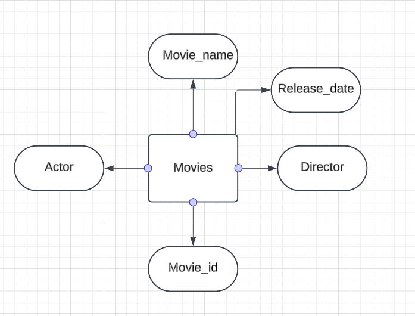
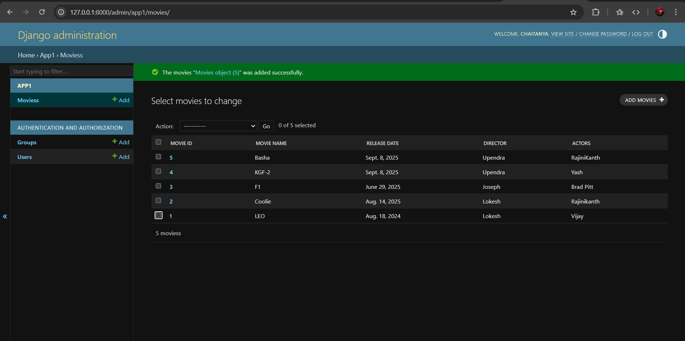

# Ex02 Djngo ORM Web Application
## Date: 08.09.2025

## AIM
To develop a Django application to store and retrieve data from Movies Database using Object Relational Mapping(ORM).

## ENTITY RELATIONSHIP DIAGRAM



## DESIGN STEPS

### STEP 1:
Clone the problem from GitHub

### STEP 2:
Create a new app in Django project

### STEP 3:
Enter the code for admin.py and models.py

### STEP 4:
Execute Django admin and create details for 10 books

## PROGRAM

**Models.py**
```
python
from django.db import models
from django.contrib import admin

class Movies(models.Model):
    Movie_ID = models.IntegerField(primary_key=True)
    Movie_name = models.CharField(max_length=100)
    Release_date=models.DateField()
    Director=models. CharField(max_length=50)
    Actors=models. CharField(max_length=100)
 
class MoviesAdmin(admin.ModelAdmin):
    list_display = ('Movie_ID', 'Movie_name', 'Release_date', 'Director', 'Actors')
```

**Admin.py**
```
python
from django.contrib import admin
from .models import Movies, MoviesAdmin
admin.site.register(Movies, MoviesAdmin)

```


## OUTPUT




## RESULT
Thus the program for creating a database using ORM hass been executed successfully
